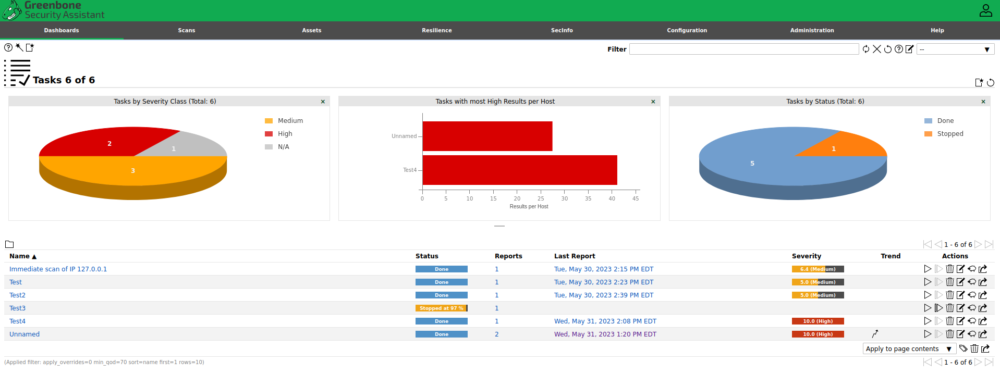
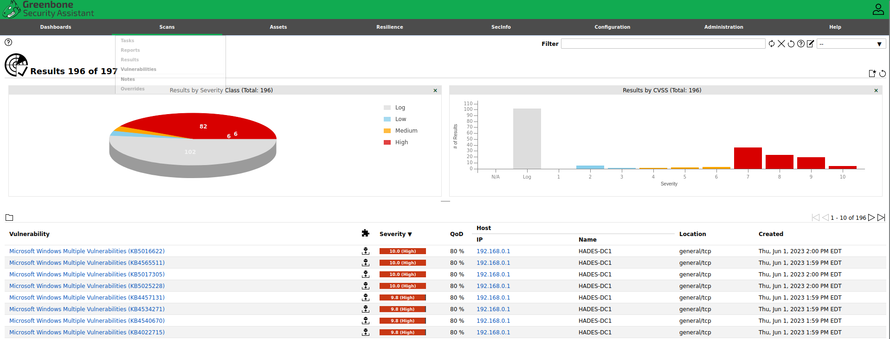
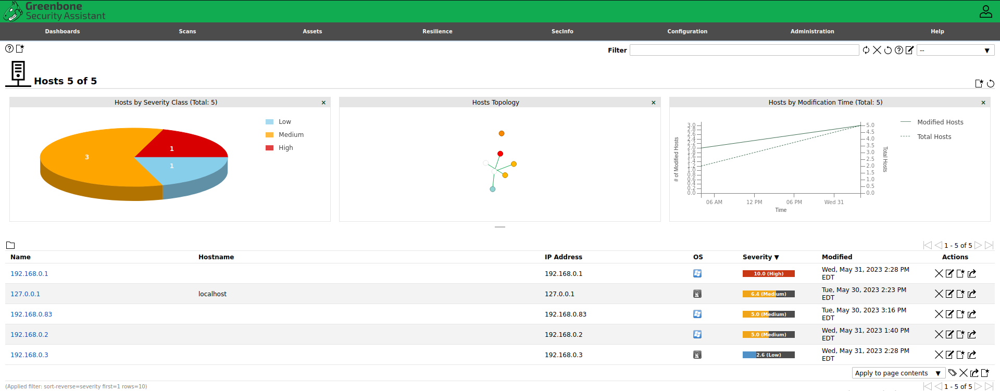
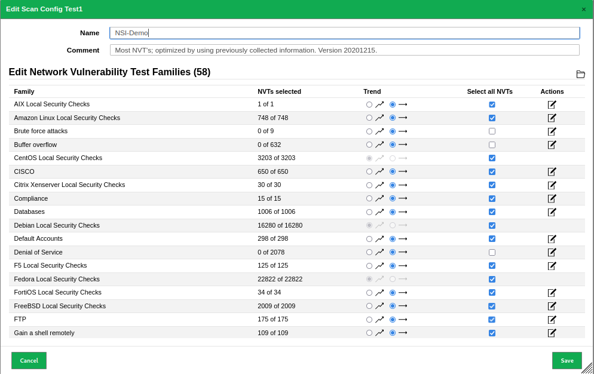
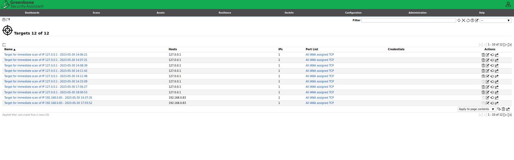
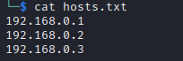
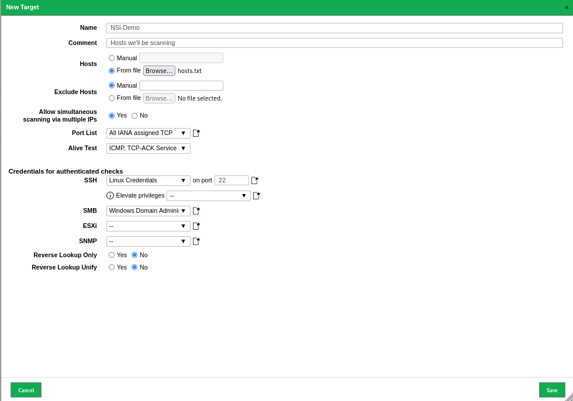
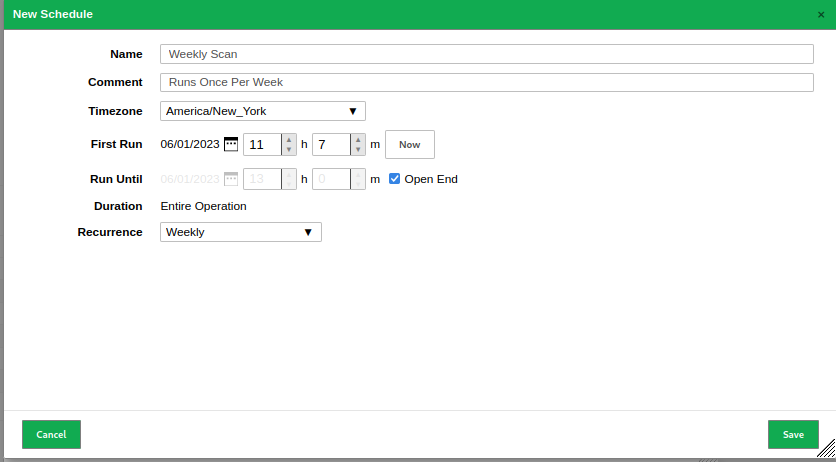
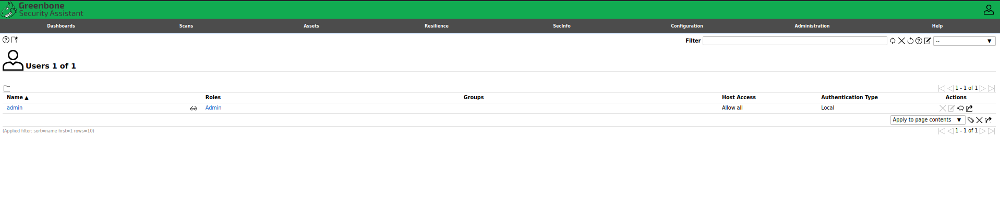

# Greenbone OpenVAS GUI Tutorial

## The Dashboard

The Dashboard is the first page you'll see after logging into your OpenVAS instance. From here you can access all other functionality of the GUI through the tabs that run along the top, and customize the front page of OpenVAS to display different metrics. 

## The Scan Tab

The Scan tab contains all of the tools necessary to schedule and run a scan. Past scans will be shown in the bottom of the pane, and metrics regarding these scans are displayed at the top.

The Scan Tab also houses the Reports and Results section, allowing you to easily view scan results and download human-readable reports.

Results and reports can be filtered prior to generation to only show the assets you desire or CVE's that you're trying to hunt down in your network. 

## The Assets Tab

The assets tab provides a graphical view of the hosts that have been previously scanned distinguished by their vulnerability ranking. 

## The Configuration Tab

This tab is where all of the controls used to configure scan templates and lists of assets are stored. From this tab, you can create a custom scan template that only runs the NVT's that you desire (i.e. if you have a Windows host that you know is vulnerable to a specific CVE, you can choose only the NVT that corresponds to it):

Note that in the above we have deselected the "Brute force attacks" and "Denial of Service" checks, as there are NVT's included in these groups which may cause disruptions in service or account lockouts.

You can also configure your lists of target hosts to be scanned via this tab:

Scan target lists need to be configured as either IP address or hostname, one per line:

A file such as the one above can easily be imported into the GUI and used to quickly establish lists of targets to scan. You can segregate your lists to include only servers in one target group and workstations in another, allowing you to have control over where OpenVAS is scanning without having to manually enter IP address ranges each time.

Here's an example of setting up a new target group, we're calling this one "NSI-Demo":

Likewise, you can also configure a schedule for the scanner through this tab. Here's an example of a configured "Weekly Scan":

## The Admininistration Tab

The Administrative Tab contains all of the controls related to access and secuirty of the Greenbone OpenVAS instance itself. User creation and permission delegations are controlled via this tab.

