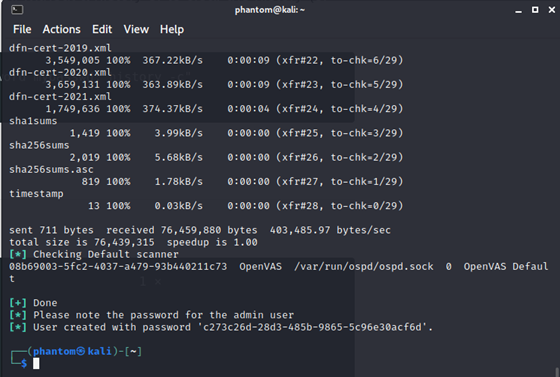

## Installation (Kali)

To install Openvas and its dependencies on our Kali Linux system run the following command:

```
sudo apt update                      

sudo apt upgrade -y

sudo apt dist-upgrade -y

sudo apt install openvas
```

Then we will run the installer itself:

```
gvm-setup
```
Note that this process make take some time to complete as 50,000+ NVT's are being downloaded. Typically, it takes less than 30 minutes to complete.

Once the install is complete, you will be prompted with a pre-configured admin user and password:



Copy this password, as you'll use it for first-time login to the GUI before you change it.

## Verify the Installation

Run the following to check your installation:

```
gvm-check-setup
```

If you receive a prompt that the installation is OK, you're good to go! You can now navigate to https://127.0.0.1:9392 to access your gvm instance.


## Starting & Stopping OpenVAS

```
sudo gvm-start
```
```
sudo gvm-stop
```

## Creating a New User

To create a new user :

```
sudo runuser -u _gvm -- gvmd --create-user=admin2 --new-password=12345  
```

To change the password of the existing user:

```
sudo runuser -u _gvm -- gvmd --user=admin --new-password=new_password 
```
